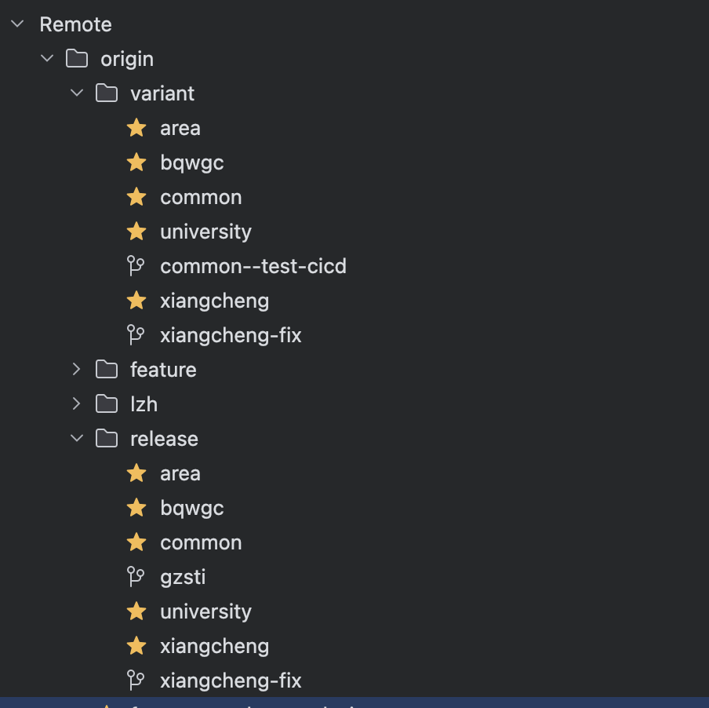

+++
date = '2023-09-01T15:11:47+08:00'
draft = true
title = 'GitLab CI/CD自动化部署流程详解'
+++


          
## 基于GitLab CI/CD的XXX系统自动化部署流程详解

本文将详细介绍基于GitLab CI/CD的xxxx系统后端自动化部署流程。整个流程采用了多阶段部署策略，实现了从代码构建到多环境部署的全自动化。

## 一、部署流程概述

整个部署流程分为以下几个阶段：

1. **安装阶段**：编译打包Java项目
2. **构建镜像阶段**：使用Kaniko构建Docker镜像
3. **生成CI配置阶段**：动态生成子流水线配置
4. **部署阶段**：触发子流水线，将应用部署到Kubernetes集群

## 二、流水线配置详解

### 2.1 流水线阶段定义

在`.gitlab-ci.yml`文件中，定义了整个流水线的阶段：

```yaml
stages:
  - install
  - build-image
  - generate-ci
  - deploy
```

### 2.2 全局变量配置

```yaml
variables:
  PROJECT_PATH: "$CI_PROJECT_DIR"
  MAVEN_OPTS: "-Dmaven.repo.local=$PROJECT_PATH/.m2/repository"
  REPO_NAME: "ikc-backend-v1"
  MAVEN_CACHE_DIR: "$PROJECT_PATH/.m2/repository"
  BUILD_CACHE_DIR: "$PROJECT_PATH/cache"
  VERSION: "$CI_PIPELINE_IID"
```

关键变量说明：
- `PROJECT_PATH`：项目路径，使用GitLab内置变量`CI_PROJECT_DIR`
- `REPO_NAME`：镜像仓库名称
- `VERSION`：版本号，使用GitLab流水线ID作为版本号

## 三、部署流程详解

### 3.1 安装阶段（Install）

这个阶段负责编译和打包Java项目：

```yaml
install:
  <<: *install_template
```

`install_template`模板定义了具体的执行步骤：

```yaml
.install_template: &install_template
  image: 172.22.121.50/gzhu/library/maven:3.8-openjdk-8
  stage: install
  # 仅在 variant/*  release/* 分支运行
  rules:
    - if: '$CI_COMMIT_REF_NAME =~ /^release\/.+$/ || $CI_COMMIT_REF_NAME =~ /^variant\/.+$/'
      when: always
    - if: '$CI_PIPELINE_SOURCE == "merge_request_event"'
      when: always
    - when: never
  <<: *cache_maven
  tags:
    - "k8s_runner_persionnel_matching"
  script:
    - cp -b settings.xml /usr/share/maven/conf/settings.xml
    - mvn clean package -Dmaven.test.skip=true
  artifacts:
    expire_in: 1 day
    paths:
      - agileboot-admin/target/agileboot-admin-1.0.0.jar
```

关键步骤：
1. 使用Maven 3.8和OpenJDK 8的镜像
2. 复制Maven配置文件
3. 执行Maven打包命令，跳过测试
4. 将构建产物（JAR包）保存为构建产物

### 3.2 构建镜像阶段（Build Image）

这个阶段负责构建Docker镜像：

```yaml
build:
  <<: *build_template
  dependencies:
    - install
```

`build_template`模板定义了具体的执行步骤：

```yaml
.build_template: &build_template
  image:
    name: 172.22.121.50/gcr/kaniko-project/executor:v1.21.0-debug
    entrypoint: [""]
  stage: build-image
  tags:
    - "k8s_runner_persionnel_matching"
  cache:
    key: "ikc-backend-v1-build"
    paths:
      - ${BUILD_CACHE_DIR}
  rules:
    - if: '$CI_COMMIT_REF_NAME =~ /^release\/.+$/ || $CI_COMMIT_REF_NAME =~ /^variant\/.+$/'
  script:
    - |
      # 配置 Docker 认证信息
      echo "{\"auths\":{\"${KCI_REGISTRY}\":{\"auth\":\"$(printf "%s:%s" "${KCI_REGISTRY_USER}" "${KCI_REGISTRY_PASSWORD}" | base64 | tr -d '\n')\"}}}" > /kaniko/.docker/config.json

      # 预热缓存
      /kaniko/warmer \
      --skip-tls-verify-pull \
      --dockerfile Dockerfile \
      --cache-dir=${BUILD_CACHE_DIR} \
      --skip-tls-verify-registry 172.22.121.50

      # 执行构建
      /kaniko/executor \
      --cache=true \
      --skip-tls-verify \
      --cache-dir=${BUILD_CACHE_DIR} \
      --dockerfile Dockerfile \
      --context $PROJECT_PATH \
      --destination 172.22.121.50/personnel-matching/${REPO_NAME}:${VERSION}
```

关键步骤：
1. 使用Kaniko构建镜像（无需Docker守护进程）
2. 配置Docker认证信息
3. 预热构建缓存
4. 执行镜像构建并推送到私有仓库

### 3.3 Dockerfile解析

Dockerfile采用了多阶段构建策略：

```dockerfile
# 第一阶段：构建阶段
FROM 172.22.121.50/gzhu/library/openjdk:8 as builder

ENV BASE_DIR="/home"

WORKDIR /$BASE_DIR

ADD ./agileboot-admin/target/*.jar ./app.jar

RUN java -Djarmode=layertools -jar app.jar extract

# 第二阶段：运行阶段
FROM 172.22.121.50/gzhu/library/openjdk:8-slim

ENV BASE_DIR="/home"

WORKDIR /$BASE_DIR

RUN apt-get update && apt-get install -y fontconfig libfreetype6 && apt-get install -y fonts-wqy-zenhei
RUN ln -sf /usr/share/zoneinfo/Asia/Shanghai /etc/localtime && echo 'Asia/Shanghai' >/etc/timezone

COPY --from=builder $BASE_DIR/dependencies/ ./
COPY --from=builder $BASE_DIR/spring-boot-loader/ ./
COPY --from=builder $BASE_DIR/snapshot-dependencies/ ./
COPY --from=builder $BASE_DIR/application/ ./

EXPOSE 10010

# 使用占位符替换 Spring profiles
ENTRYPOINT ["java", "-Dspring.profiles.active=basic,base,extended", "org.springframework.boot.loader.JarLauncher"]
```

关键步骤：
1. 第一阶段：使用Spring Boot的layertools提取JAR包分层
2. 第二阶段：使用轻量级基础镜像，复制分层文件，设置时区和字体
3. 暴露10010端口并设置启动命令

### 3.4 生成CI配置阶段（Generate CI）

这个阶段负责动态生成子流水线配置：

```yaml
generate-ci-pipeline:
  image: 172.22.121.50/gzhu/alpine-delpoy:3.12
  stage: generate-ci
  dependencies:
    - build
  artifacts:
    paths:
      - child-ci.yml
  rules:
    - if: '$CI_COMMIT_REF_NAME =~ /^release\/.+$/ || $CI_COMMIT_REF_NAME =~ /^variant\/.+$/'
  script:
    - chmod +x generate-deploy-ci-config.sh
    - bash -x generate-deploy-ci-config.sh
    - cat child-ci.yml
```

关键步骤：
1. 使用Alpine基础镜像
2. 执行`generate-deploy-ci-config.sh`脚本生成子流水线配置
3. 将生成的`child-ci.yml`保存为构建产物

### 3.5 动态配置生成脚本解析

`generate-deploy-ci-config.sh`脚本负责根据分支名称动态生成部署配置：


```bash
# 确定 GROUP 和 SUB_ENV 基于分支名称
if [[ "$CI_COMMIT_REF_NAME" =~ ^variant/(.+)$ ]]; then
  SUB_ENV=test
  GROUP="${BASH_REMATCH[1]}"
elif [[ "$CI_COMMIT_REF_NAME" =~ ^release/(.+)$ ]]; then
  SUB_ENV=prod
  GROUP="${BASH_REMATCH[1]}"
else
  echo "Unrecognized branch: $CI_COMMIT_REF_NAME"
  exit 1
fi

# 使用 yq 获取对应 GROUP 下的所有 ENVS
ENVS=$(yq e ".${GROUP} | keys | .[]" environments.yml)
```

关键逻辑：
1. 根据分支名称确定部署环境类型（test/prod）和分组
   - `variant/*`分支对应测试环境
   - `release/*`分支对应生产环境
2. 从`environments.yml`中获取对应分组下的所有环境
3. 为每个环境生成对应的部署任务

### 3.6 部署阶段（Deploy）

这个阶段负责触发子流水线执行部署：

```yaml
deploy-pipeline:
  stage: deploy
  rules:
    - if: '$CI_COMMIT_REF_NAME =~ /^release\/.+$/ || $CI_COMMIT_REF_NAME =~ /^variant\/.+$/'
      when: always
    - when: never
  trigger:
    include:
      - artifact: child-ci.yml
        job: generate-ci-pipeline
    strategy: depend
```

关键步骤：
1. 使用`trigger`指令触发子流水线
2. 子流水线配置来自`generate-ci-pipeline`任务生成的`child-ci.yml`

### 3.7 子流水线部署任务

子流水线中的部署任务示例：

```yaml
deploy_${ENV}_${SUB_ENV}:
  stage: deploy-child
  image:
    name: 172.22.121.50/dockerio/bitnami/kubectl:1.23
    entrypoint: [""]
  tags:
    - "k8s_runner_persionnel_matching"
  rules:
    - if: '\$CI_COMMIT_REF_NAME =~ /^variant\/.+$/'
      when: on_success
    - if: '\$CI_COMMIT_REF_NAME =~ /^release\/.+$/'
      when: manual
    - when: never
  script:
    - echo "Deploying ${REPO_NAME} to ${ENV}/${SUB_ENV} with CONTEXT_PATH=${CONTEXT_PATH} APP=${ENV}"
    - sed -i 's#{{REPO_NAME}}#${REPO_NAME}#g' $PROJECT_PATH/deployment.yaml
    - sed -i 's#{{ENV}}#${ENV}#g' $PROJECT_PATH/deployment.yaml
    - sed -i 's#{{SUB_ENV}}#${SUB_ENV}#g' $PROJECT_PATH/deployment.yaml
    - sed -i 's#{{CONTEXT_PATH}}#${CONTEXT_PATH}#g' $PROJECT_PATH/deployment.yaml
    - sed -i 's#{{VERSION}}#${VERSION}#g' $PROJECT_PATH/deployment.yaml
    - kubectl apply -f $PROJECT_PATH/deployment.yaml
  allow_failure: true
```

关键步骤：
1. 使用kubectl镜像
2. 替换`deployment.yaml`中的占位符
3. 使用`kubectl apply`命令部署到Kubernetes集群
4. 测试环境自动部署，生产环境手动触发

### 3.8 Kubernetes部署配置

`deployment.yaml`定义了Kubernetes部署配置：

```yaml
apiVersion: apps/v1
kind: Deployment
metadata:
  name: {{REPO_NAME}}-{{ENV}}-{{SUB_ENV}}
  labels:
    app: {{REPO_NAME}}-{{ENV}}-{{SUB_ENV}}
spec:
  replicas: 1
  selector:
    matchLabels:
      app: {{REPO_NAME}}-{{ENV}}-{{SUB_ENV}}
  template:
    metadata:
      labels:
        app: {{REPO_NAME}}-{{ENV}}-{{SUB_ENV}}
    spec:
      containers:
        - name: {{REPO_NAME}}-{{ENV}}-{{SUB_ENV}}-service
          image: 172.22.121.50/personnel-matching/{{REPO_NAME}}:{{VERSION}}
          ports:
            - containerPort: 10010
          volumeMounts:
            # 挂载各种配置文件...
```

关键配置：
1. 定义了Deployment和Service资源
2. 使用ConfigMap挂载多个配置文件
3. 配置了健康检查

## 四、环境配置管理

`environments.yml`文件定义了多个部署环境的配置：

```yaml
university:
  gzhu:
    context_path: "/university-gzhu"
  scnu:
    context_path: "/university-scnu"
  # 更多大学环境...

common:
  common:
    context_path: "/common"
  # 更多通用环境...

# 更多环境分组...
```

这个文件定义了不同分组下的环境及其上下文路径，用于动态生成部署配置。

## 五、部署流程总结

整个部署流程可以总结为以下步骤：

1. **代码编译打包**：使用Maven编译Java项目并生成JAR包
2. **构建Docker镜像**：使用Kaniko构建多阶段Docker镜像并推送到私有仓库
3. **生成部署配置**：根据分支名称和环境配置动态生成子流水线配置
4. **执行部署**：触发子流水线，为每个目标环境执行Kubernetes部署

这种设计具有以下优点：

1. **环境隔离**：不同环境的部署配置完全隔离
2. **自动化程度高**：从编译到部署全自动化
3. **灵活性强**：可以轻松添加新的部署环境
4. **安全可控**：测试环境自动部署，生产环境手动确认

通过这种CI/CD流水线设计，实现了XXX系统后端的高效自动化部署。
