+++
date = '2025-01-01'
draft = true
title = '资分'
+++

# 第一章 实用速算技巧

## 1.0 总体

### 方法概览

- 加法： 尾数法 高位叠加 
- 减法： 分段法 基准值 
- 乘法： 小分互换 乘法拆分 乘法放缩 
- 除法： 拆分 除法放缩

### Tip

- Tip1：巧用等差数列求和
- Tip2：相邻百位数减法时，可插入基准值
- Tip3：过程中抵消误差
- Tip4：除法分类
- Tip5：50%附近的拆分，分母尽量是偶数，注意同进同舍
- Tip6：拆分还可拆 1/3、1/4

## 1.1 加法技巧——尾数法、高位叠加法

### 1.1.1 尾数法

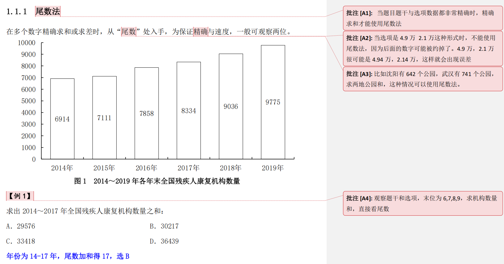


```
【例 2】 
外国来华申请量排名前 10 位的国家或地区分别是美国、日本、韩国、英国、德国、英属维尔京群岛、法国、意大利、瑞士、澳大利亚，申请量分别为 26060 件、19715件、6318 件、5588 件、3796 件、3461 件、3243 件、2865 件、2124 件、2085 件。
问题：2011 年，外国来华商标申请量排名前 10 位的国家或地区的申请量之和为：
A．75255 件 B．75525 件
C．76215 件 D．79585 件

解析：: 申请量为具体件数，数值精确，直接尾数加。但注意，选项末尾都是 5，要用末两位尾数来计算。60+15=75 18+88=106 96+61=157 43+65=108 24+85=109，五个数加和尾数为 55，定位 A 项。
```

### 1.1.2 高位叠加

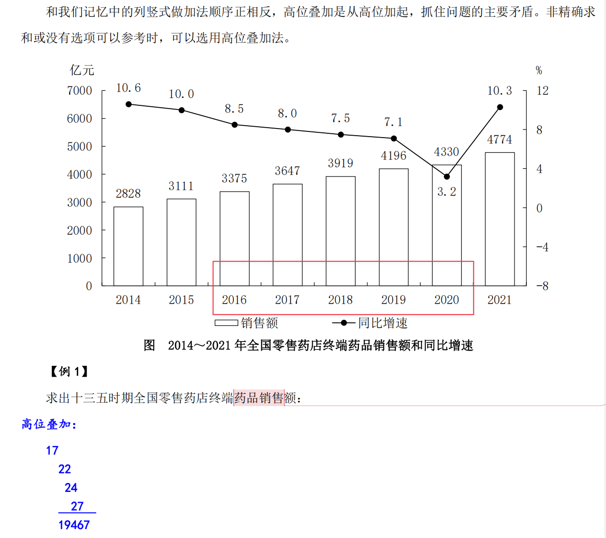

## 1.2 减法技巧--分段法 

将多位数（三位、四位）的减法分成两段，尽可能保证不用借位；若无法保证不借位，可以用负数代替借位。

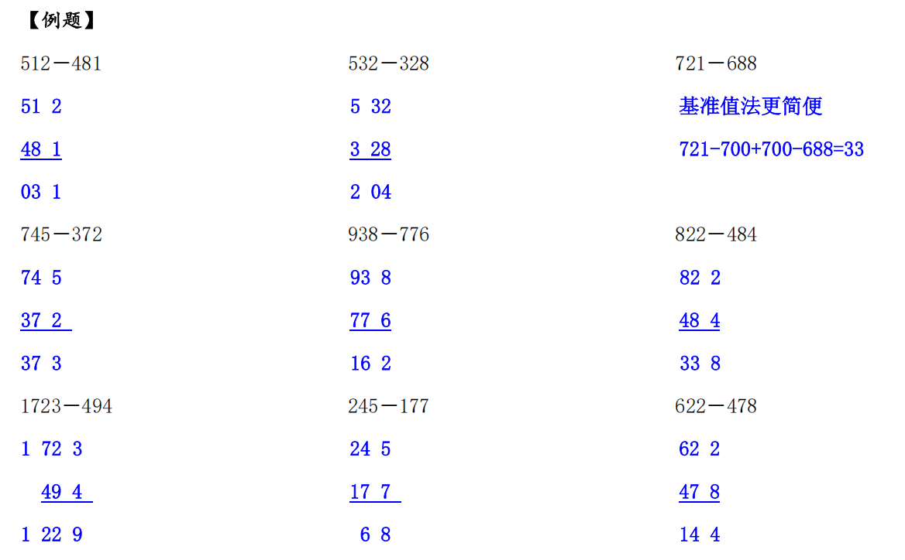

## 1.3 乘法技巧--小分互换法、拆分法、放缩法

### 1.3.1 小分互换法
 
若乘法中有某个乘数可以近似的转化为某个常见分数，我们可以将多位数乘法转化为简单除法计算;一个数字乘以 5、25、125，可转化为除 2、4、8.
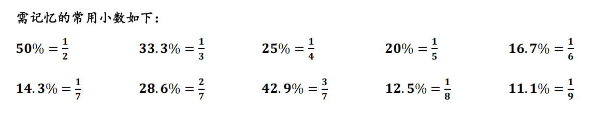

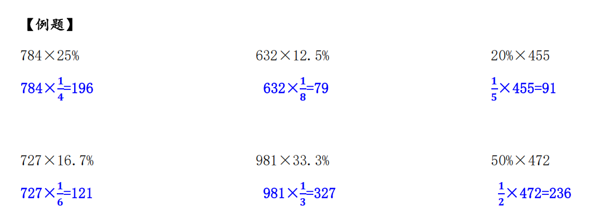

### 1.3.2 拆分法

若乘法中有某个乘数为百分数且能拆成两个简单数值（50%、10%、5%等），我们可以将该百分数拆成两部分相乘，要擅用“1%”。

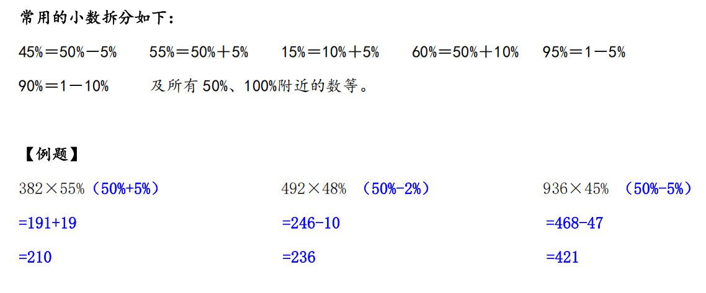
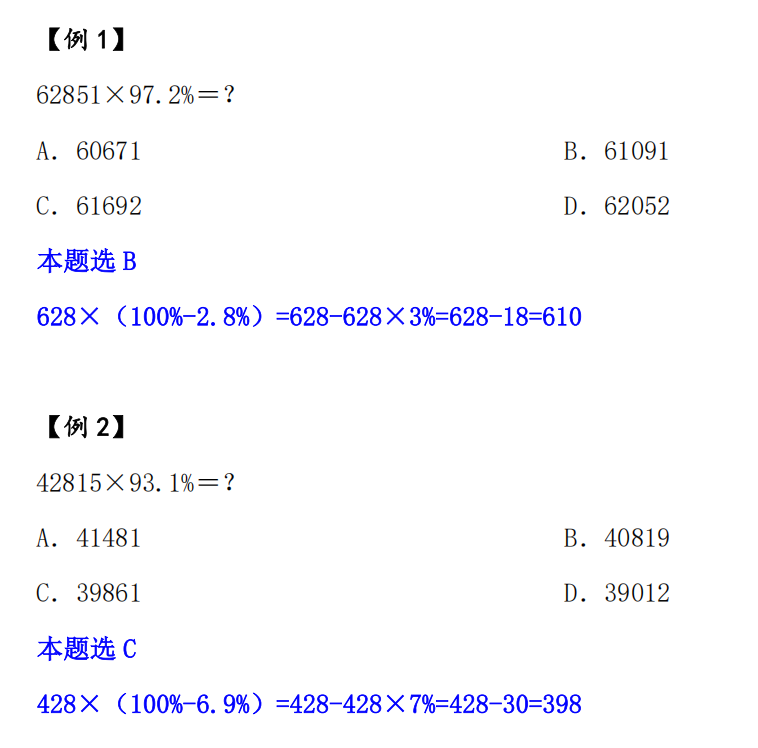
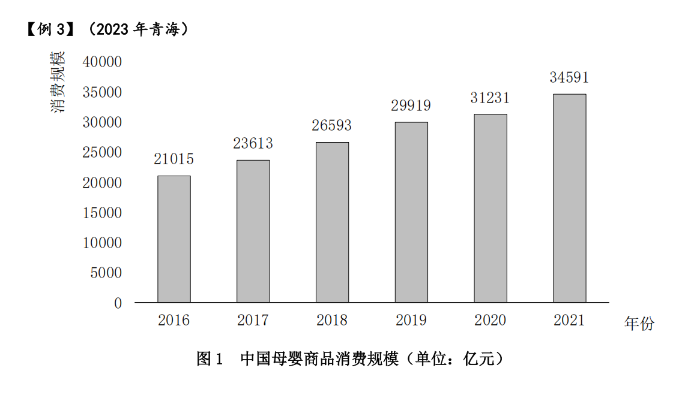
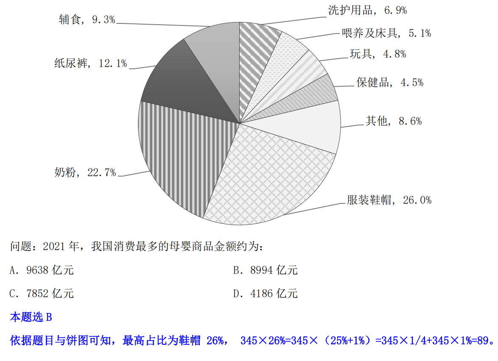

### 1.3.3 放缩法

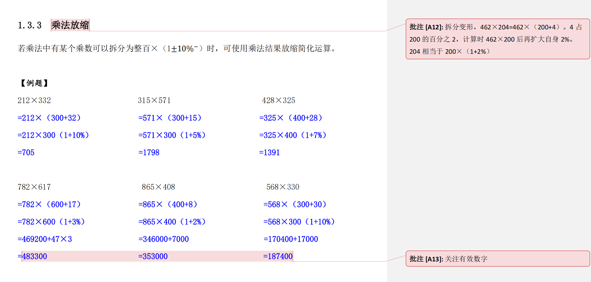

## 1.4 除法技巧--拆分法、放缩法

### 1.4.1 拆分法

拆分法是对直除的“优化”，可借助选项“猜”出答案，尤其适合分子位数小于等于分母的除法计算。
拆分法具体应用：
一、如果分子在分母的 50%附近，先拆出 50%；
二、如果分数大小约等于 1（分子分母相差不大），可先拆出 100%；
三、如果分子很小，可根据实际情况拆出 10%或 5%或 1%;

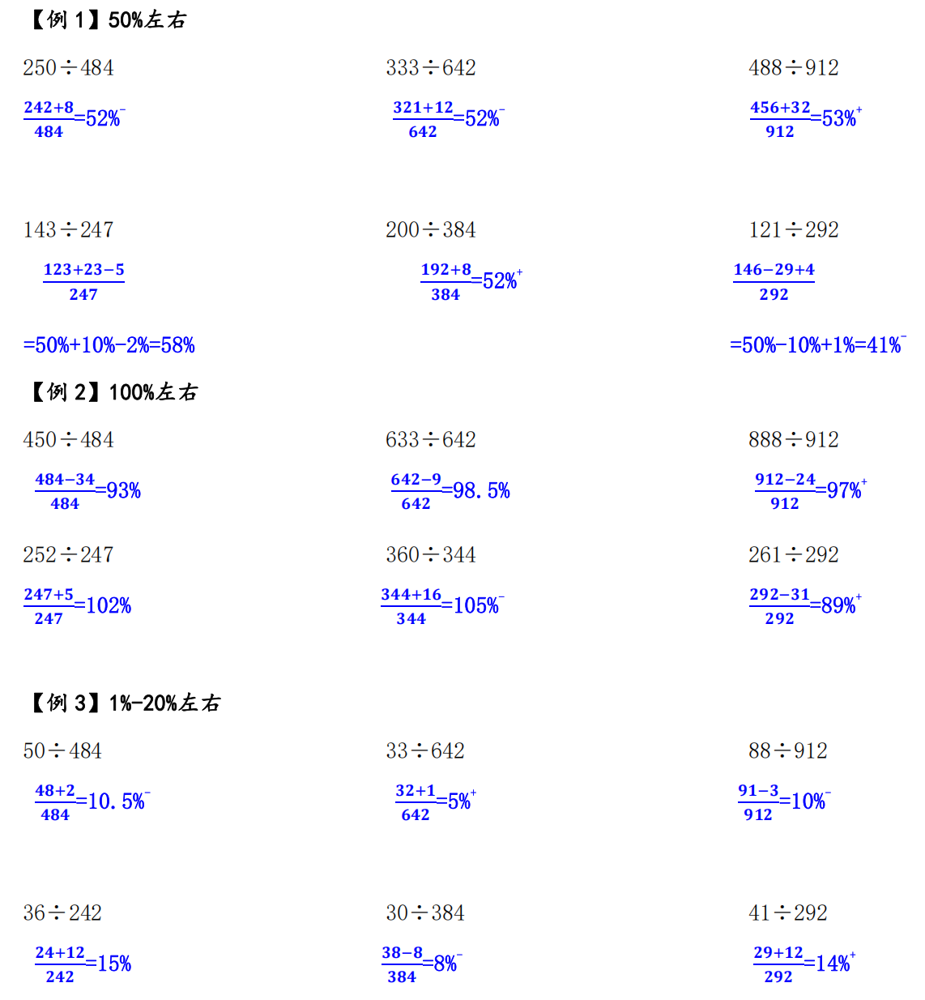

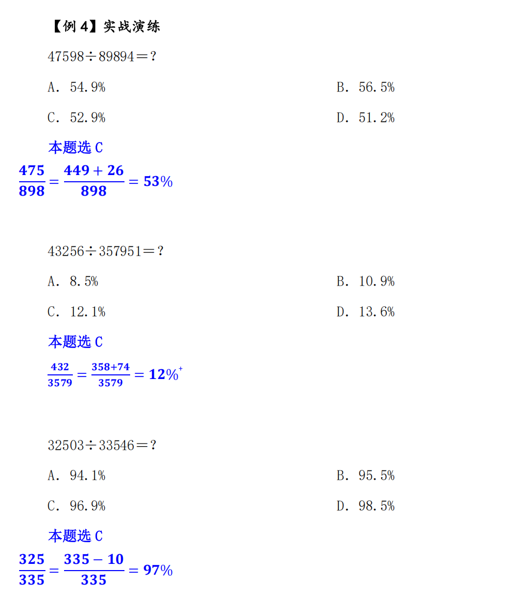

### 1.4.2 除法放缩 

除法放缩的原理：分子分母同时扩大或缩小相同的幅度，分式不变。
除法放缩的适用范围：
①分母接近整百；
②多个数乘除中分子分母接近整数倍。
【注意】分子分母同舍同进。

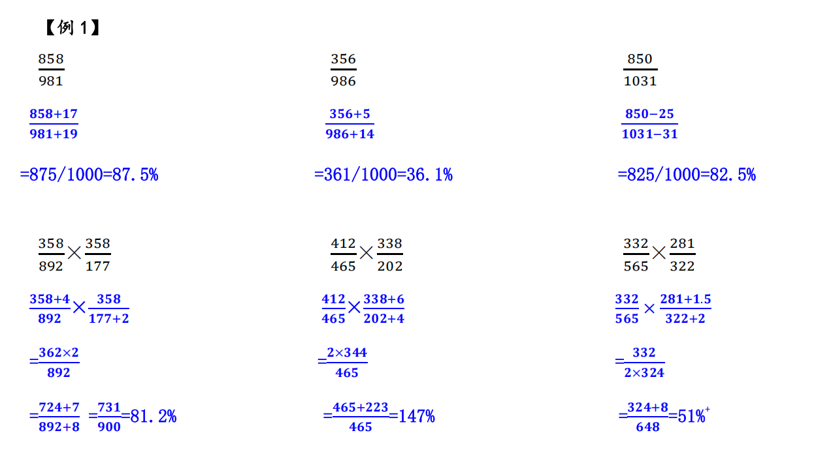