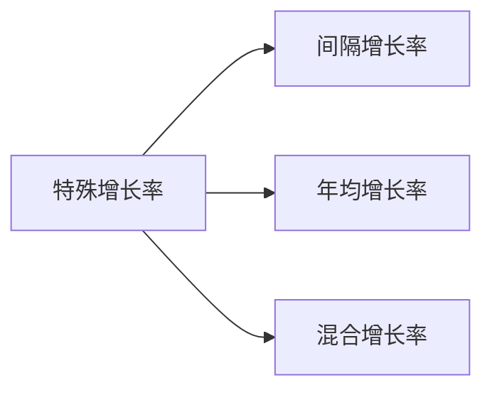
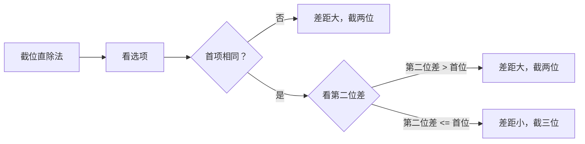

+++
date = '2025-04-16T10:40:03+08:00'
draft = true
title = 'Material Analysis'
+++

## 来源

资料分析题目材料一般有以下两个来源

- [国家统计局](https://www.stats.gov.cn/)
- 地方统计局

# 题型

## 1. 特殊增长率



### 1.1 间隔增长率

```plaintext
【例 1】（2024 四川）2022年，全国软件和信息技术服务业规模以上企业超 3.5 万家，累计完成软件业务收入 108126 亿元，同比增长 11.2%，增速较上年同期回落 6.5 个百分点。
2022 年，全国软件和信息技术服务业规模以上企业累计完成软件业务收入约比 2020 年增长了：
A.16% B.23% C.29% D.31%

1. 2021年的增长率: 11.2%+6.5%=17.7%
​2. ​复合增长率计算​​：
    假设2020年收入为A，则：
    2021年收入：A×(1+17.7%)
    2022年收入：A×(1+17.7%)×(1+11.2%)
    总增长率：(1+17.7%)×(1+11.2%)−1=1.177×1.112−1≈1.3088−1=30.88%
​3. 答案：D
```

<b>速算技巧</b>：\(r_{间隔} = r_1 + r_2 + r_1 \cdot r_2\) 
<b>重要说明</b>：如果\(r_1\)和\(r_2\)均小于10%（\(r_1*r_2 < 1\% \)）， 可以忽略\(r_1 \cdot r_2\)计算，上述公式变为：\(r_{间隔} = r_1 + r_2\)
<b>解题</b>：
\(r_1 = 17.7\%\)和\(r_2=11.2\%\)，则 \(r_{间隔} = r_1 + r_2 =  28.9\%\)，排除 AB
\(r_1 \cdot r_2 ≈ 1.8 \% \)，排除 C，D 正确

## 难点

- 读不懂 —— 统计术语
- 找不着 —— 结构阅读
- 列不对 —— 重点题型
- 算得慢 —— 速算技巧

## 统计学概念

- 基期
- 现期

- 基期量
- 现期量
- 增长量

- 同比
- 环比

- 增长率
- 增幅
- 增长幅度

- 增长率
  - 增长率比大小
  - 年均增长率
  - 间隔增长率
  - 间隔增长倍数
  - 混合增长率
- 增长量
  - 增长量比大小
  - 年均增长量
  - 间隔增长量
  - 间隔增长倍数

- 平均数
  - 现期平均数
  - 基期平均数
  - 平均增长率
  - 平均增长倍数

- 基尼系数
衡量收入分配差距
  - 取值范围在0到1之间：
  - 0表示收入完全平等（所有人收入相同）
  - 1表示收入完全不平等（一个人占有全部收入）
  - 国际警戒线为0.4
  - 基尼系数越大，表示收入分配差距越大
  - 通常用来衡量一个国家或地区的贫富差距程度

- 恩格尔系数
  食品支出总额占个人消费支出总额的比重
  - 60%以上：贫困
  - 50-59%：温饱
  - 40-49%：小康
  - 30-39%：富裕
  - 20-29%：极其富裕


## 截位直除法

1. 看选项，差距大截两位、差距小截三位 
2. 看式子，一步除截分母、多步除都要截 
3. 看答案，能不算就不算


