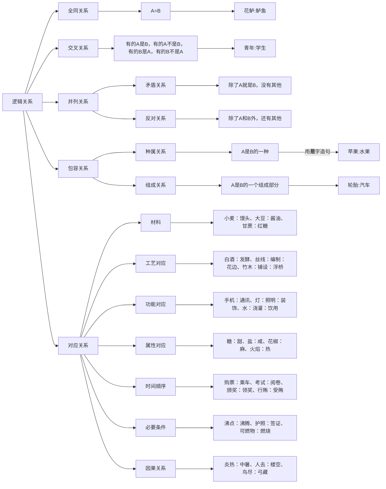

+++
date = '2025-05-08T14:52:34+08:00'
draft = true
title = '类比推理-逻辑关系'
+++
### 逻辑关系一览表

### 全同关系词表

- 花鲈:鲈鱼
- 杜鹃鸟:杜鹃:子规:谢豹
- 读书人:秀才:学伯:生员
- 甘薯：地瓜
- 荷花：莲花：芙蕖：水芙蓉：菡萏 
- 纸鸢：风筝
- 芝麻：脂麻
- 伛偻yǔlǚ：黄发：老人
- 乞巧节：七夕节
- 蚍蜉：大蚂蚁
- 碳酸气：二氧化碳
- 水：氧化氢

- 君子四雅：香事、茶事、花事、画事
- 文人四友：琴、棋、书、画