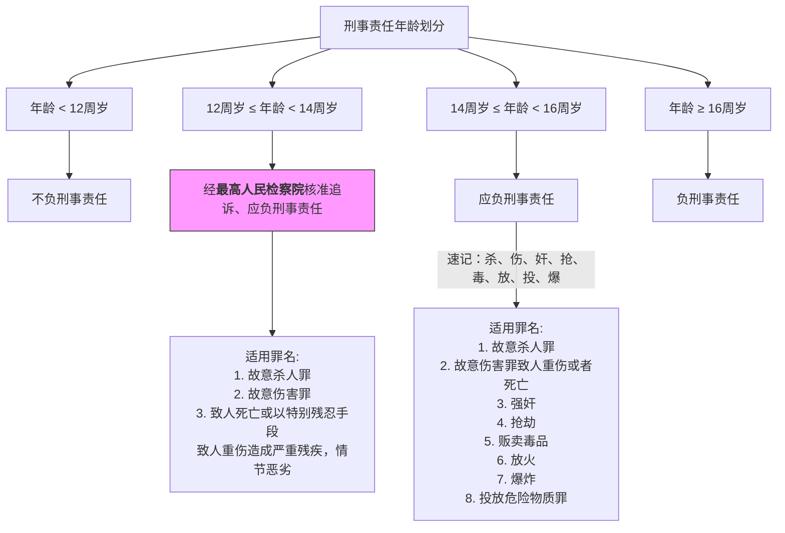
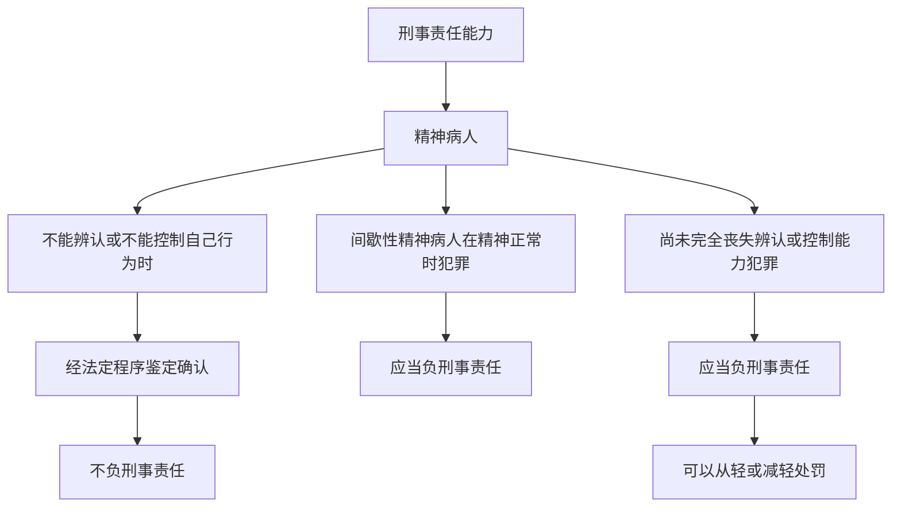
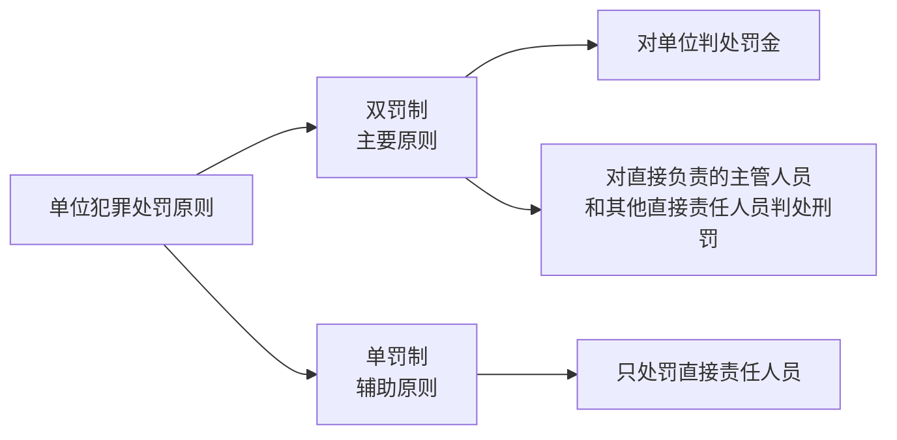
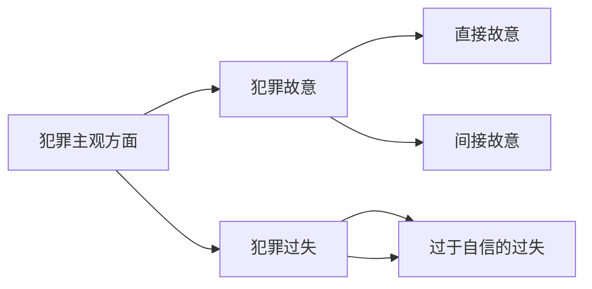

+++
date = '2025-05-09T11:14:46+08:00'
draft = true
title = '常识-刑法'
+++

<!-- # 犯罪论

## 犯罪构成 -->

### 犯罪主体

#### 1. 自然人犯罪

##### （1）刑事责任年龄

##### (2) 刑事责任能力

#### 2. 单位犯罪

### 犯罪主观方面

指的是犯罪主体对自己危害社会的行为及危害社会的结果所抱的心理态度，包括：

