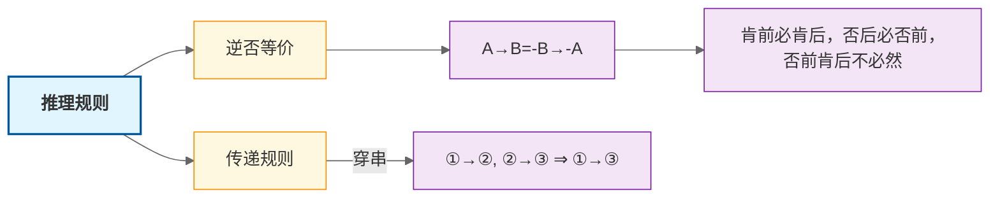

+++
date = '2025-05-08T14:52:34+08:00'
draft = true
title = '判断推理-逻辑判断'
+++
## 翻译推理

### 1. 题型识别

（1）题干出现明显的逻辑关联词
（2）提问方式为"可以推出"、"不可以推出"

### 2. 解题思维

 先翻译，再推理，注意：尽量不要通过理解语义来解题，会有偏差

### 3. 翻译规则

#### 3.1 前推后

  **(1)** 如果······那么······

  **(2)** 若······则······

  **(3)** 只要······就······

  **(4)** 所有······都······

  **(5)** 为了······一定······

#### 3.2 后推前

  **(1)** 只有······才······

  **(2)** 不······不······

  **(3)** 除非······否则不······

  **(4)** ······是······的基础/假设/前提/关键

  **(5)** ······是······的必要条件/必不可少的条件

#### 3.3 易错点

- **谁是必要条件，谁放在箭头后**
- 
- **除非······否则······**

### 4. 推理规则

### 5. 且或关系

#### 5.1. "且"类系
  
- 和
- 并且
- 既......又......
- 不仅......而且......
- 虽然......但是......

#### 5.2. "或"类系

- ......或者......
- 或者......或者......
- ......和......至少有一个
- 当"或"类系为真时，否定一项可以得到另一项，即是：“否1推1”

5.3. 德·摩根定律

- -(A且B)=-A或-B
- -(A或B)=-A且-B