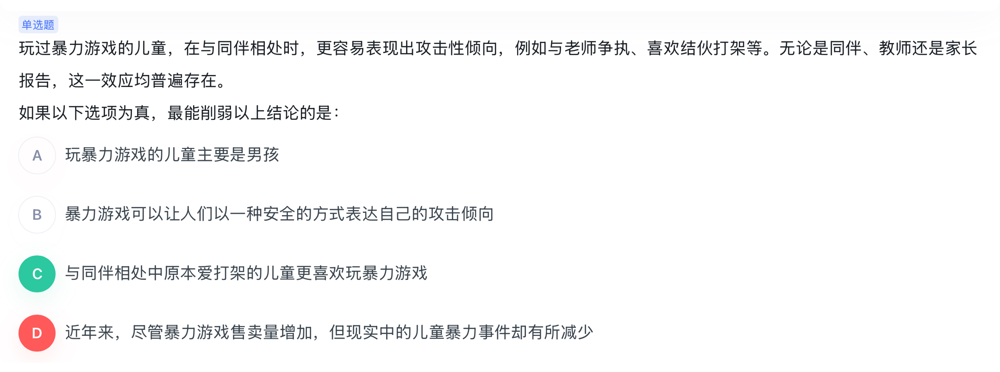

# 削弱推理

## 削弱强度

否论点  > 拆桥 > 否论据 > 因果倒置 > 他因削弱

做题技巧： 论点论据不同有拆桥选项秒选。有因果关系秒选因果倒置，无因果倒置选他因削弱。

### 因果倒置

**论点**：玩过暴力游戏的儿童，在与同伴相处时，更容易表现出攻击性倾向。（玩暴力游戏  ——>  表现攻击性倾向）

**论据**：例如与老师争执、喜欢结伙打架等。无论是同伴、教师还是家长报告，这一效应均普遍存在。

C选项：与同伴相处中原本爱打架的儿童更喜欢玩暴力游戏（ 有攻击性倾向 ——> 爱玩暴力游戏）