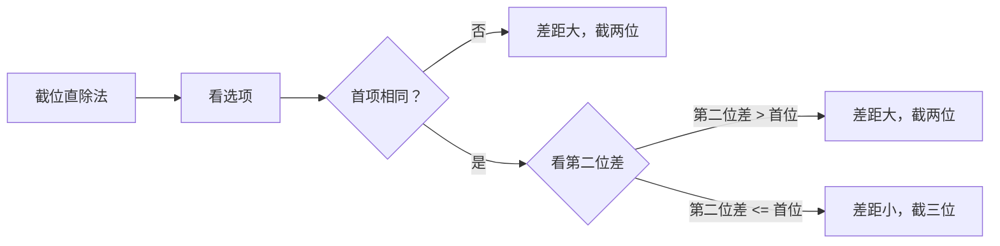
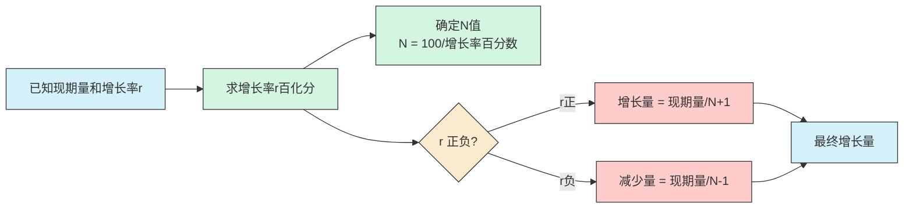
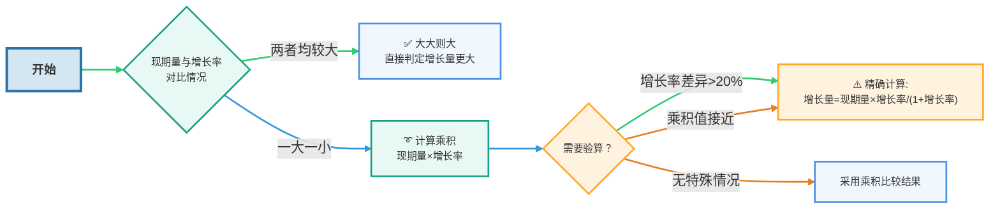
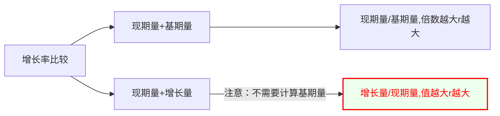
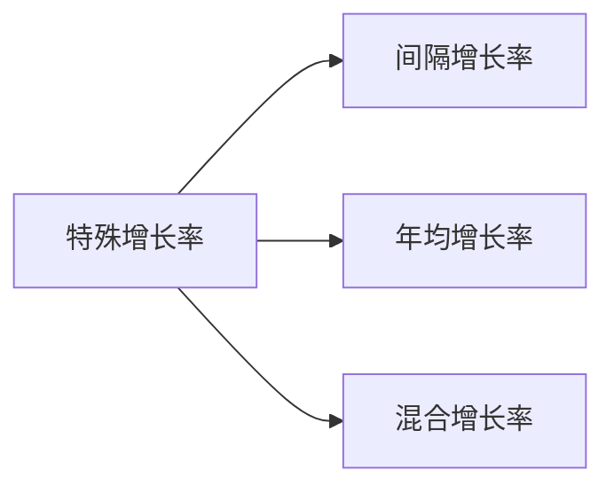

+++
date = '2025-04-16T10:40:03+08:00'
draft = false
title = 'Material Analysis'
+++

## 一、来源

资料分析题目材料一般有以下两个来源

- [国家统计局](https://www.stats.gov.cn/)
- 地方统计局

## 二、难点

- 读不懂 —— 统计术语
- 找不着 —— 结构阅读
- 列不对 —— 重点题型
- 算得慢 —— 速算技巧

## 三、速算

### 1.截位直除法



1. 看选项，差距大截两位、差距小截三位 
2. 看式子，一步除截分母、多步除都要截 
3. 看答案，能不算就不算

## 四、题型

### 增长量N+1、N-1原则

已知现期、增长率，求增长量

1. 求增长率百化分(N是分母)
2. 增长量=现期/N+1， 减少量=现期/N-1



```plaintext
练习1：老邓资产300亿，同比增长50%，求同比增量？
解答：N=2, 300/(2+1)=100亿
练习2：老邓身高2米4，同比增长20%，求同比增量？
解答：N=5, 2.4/(5+1)=40厘米
练习3：老邓体重200斤，同比减少25%，求同比减少量？
解答：N=4, 200/(4-1)约为66斤
```

#### 增长率百化分之取中法
如果遇到百分数左右难取舍，取中即可
 $15.4\% ≈ \frac{1}{6.5}$

 $18.4\% ≈ \frac{1}{5.5}$

### 增长量比大小

识别：增长量排序或增长+多/少

题型1: 已知现期量和基期量：增长量=现期-基期
- 柱形图可以看高度差

题型2: 已知现期量和增长率：大大则大，一大一小看乘积（/看倍数），例外情况需验算

已知一组数据，每个数据已知现期量、增长率（有正负），比较增长量大小
- 现期量大，且增幅大，其增长量大；
- 现期量大，且降幅大，其减少量大。




### 1.增长率比较

识别：增长率排序或增长+最快/慢



---

### 已知增长量和现期量，不算基期量可以比较$r$大小？

 $r = \frac{增量}{基期量} = \frac{增量}{现期量 - 增量} = \frac{\frac{增量}{现期量}}{1 - \frac{增量}{现期量}} = \frac{k}{1 - k}$

则 $k 越大 → r 越大$

增量为负数时，结论依然成立：
增量越大（更接近0的负数）， $Δ/Q$ 比值越大，对应增长率$r$下降幅度越小（即$r$相对更大）。数学逻辑未改变，但需注意负数大小比较的方向。


```plaintext
2021年数据​​：
​企业​​：参保人数23317万人，比上年增加1050万人
​​机关事业​​：参保人数6387万人，比上年增加155万人
​​灵活就业等其他​​：参保人数4751万人，比上年增加325万人

判断“2020年，三类职工医保参保人员中，灵活就业等其他人员参保人数同比增速最快。”（A）
A. 正确　　　B. 错误


题型：问三类人员谁的同比增速最快--增长率比较
方法：直接比 增长量/现期量 大小
```

---

### 2. 特殊增长率



### 2.1 间隔增长率

```plaintext
【例 1】（2024 四川）2022年，全国软件和信息技术服务业规模以上企业超 3.5 万家，累计完成软件业务收入 108126 亿元，同比增长 11.2%，增速较上年同期回落 6.5 个百分点。
2022 年，全国软件和信息技术服务业规模以上企业累计完成软件业务收入约比 2020 年增长了：
A.16% B.23% C.29% D.31%

1. 2021年的增长率: 11.2%+6.5%=17.7%
​2. ​复合增长率计算​​：
    假设2020年收入为A，则：
    2021年收入：A×(1+17.7%)
    2022年收入：A×(1+17.7%)×(1+11.2%)
    总增长率：(1+17.7%)×(1+11.2%)−1=1.177×1.112−1≈1.3088−1=30.88%
​3. 答案：D
```

<b>速算技巧</b>：$r_{间隔} = r_1 + r_2 + r_1 \cdot r_2$ 
<b>重要说明</b>：如果$r_1$和$r_2$均小于10%（$r_1*r_2 < 1\% $）， 可以忽略$r_1 \cdot r_2$计算，上述公式变为：$r_{间隔} = r_1 + r_2$
<b>解题</b>：
$r_1 = 17.7\%$和$r_2=11.2\%$，则 $r_{间隔} = r_1 + r_2 =  28.9\%$，排除 AB
$r_1 \cdot r_2 ≈ 1.8 \% $，排除 C，D 正确

### 2.2 年均增长率

### 2.3 混合增长率


## 五、统计学概念

- 基期
- 现期

- 基期量
- 现期量
- 增长量

- 同比
- 环比

- 增长率
- 增幅
- 增长幅度

- 增长率
  - 增长率比大小
  - 年均增长率
  - 间隔增长率
  - 间隔增长倍数
  - 混合增长率
- 增长量
  - 增长量比大小
  - 年均增长量
  - 间隔增长量
  - 间隔增长倍数

- 平均数
  - 现期平均数
  - 基期平均数
  - 平均增长率
  - 平均增长倍数

- 基尼系数
衡量收入分配差距
  - 取值范围在0到1之间：
  - 0表示收入完全平等（所有人收入相同）
  - 1表示收入完全不平等（一个人占有全部收入）
  - 国际警戒线为0.4
  - 基尼系数越大，表示收入分配差距越大
  - 通常用来衡量一个国家或地区的贫富差距程度

- 恩格尔系数
  食品支出总额占个人消费支出总额的比重
  - 60%以上：贫困
  - 50-59%：温饱
  - 40-49%：小康
  - 30-39%：富裕
  - 20-29%：极其富裕


## 基础百化分表

基础百化分表（1-20）（仅保留需技巧记忆项）

| 分数   | 近似百分数 | 记忆规则                |
|--------|------------|-------------------------|
| 1/6  | 16.7%      | 与1/16互换（16.7%→1/6） |
| 1/7  | 14.3%      | 与1/14互换（14.3%→1/7） |
| 1/9  | 11.1%      | 整数部分+分母=20（11+9）|
| 1/11 | 9.1%       | 整数部分+分母=20（9+11）|
| 1/12 | 8.3%       | 整数部分+分母=20（8+12）|
| 1/13 | 7.7%       | 整数部分+分母=20（7+13）|
| 1/14 | 7.1%       | 与1/7互换（7.1%→1/14）  |
| 1/15 | 6.7%       | 特殊记忆“567”           |
| 1/16 | 6.25%      | 与1/6互换（6.25%→1/16） |
| 1/17 | 5.9%       | 5.0369等差数列（5.9→5.6→5.3）|
| 1/18 | 5.6%       | ↑同上                   |
| 1/19 | 5.3%       | ↑同上                   |


$当r>0(增长率为正),基期 = \frac{现期}{1+r}=现期*(1-r)$


## 1. 同比与环比

- 同比：和去年同时期相比
- 环比：和上一个统计周期相比
## 2. 基期量计算

- 已知现期量、增长量，基期 = 现期 - 增长量
- 已知现<font color="#c00000">期量、增长率</font>，$基期 = \frac{现期}{1+r}$


## 3. 增长量计算

### 增长量N+1与N-1原则
$增长量N \pm 1 原则$ 

 已知现期、增长率，求增长量
 第一步：求增长率的[百化分](./速算技巧#百化分)，例如：$r=25\%  、\frac{1}{4} = 25\%$，所以 $N=4 \%$
 第二步： $增长量 = \dfrac{现期}{N + 1}, 减少量 = \dfrac{现期}{N - 1}$

### 化除为乘
 已知现<font color="#c00000">期量、增长率</font>，$基期 = \frac{现期}{1+r}，当|r| \leq 5\%$：
 $当增长率为正,基期 = \frac{现期}{1+r}=现期*(1-r)$
$当增长率为负,基期 = \frac{现期}{1-r}=现期*(1+r)，r为增长率绝对值$


## 4. 增长率计算

 题型识别： 问增长率或增长/下降+%(选项)
- 已知现期、基期，求增长率：$r = \frac{增量}{ 基期} = \frac{ 现期 -  基期}{ 基期} = \frac{ 增量}{ 现期 -  增量}$
- 已知现期、基期，求增长率：$r = \frac{增量}{ 基期} = \frac{ 现期 -  基期}{ 基期} = \frac{ 现期}{ 基期}-1$

## 5. 增长率的比较

 题型识别： 增长率排序、增长率增长+最快/最慢
 - 方法一：已知<font color="#ff0000">现期、基期</font>，求<font color="#00b050">现期/基期</font>的倍数越大，增长率r越大
 - 方法二：已知<font color="#ff0000">现期、增长量</font>，求<font color="#00b050">增量/现期 </font>越大，增长率r越大（不需要算基期量）


