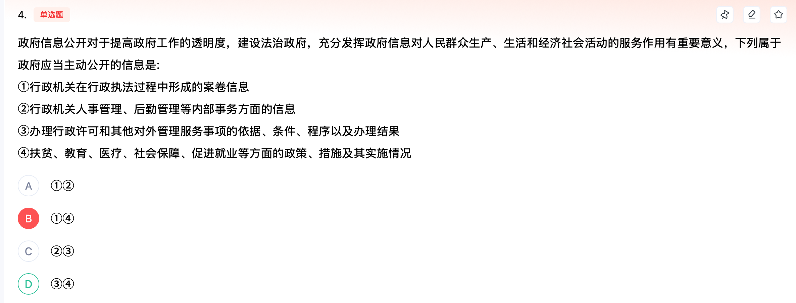
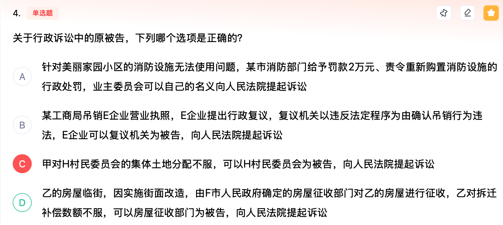
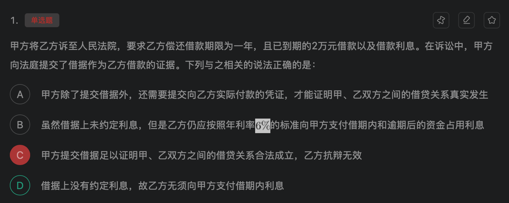

+++
date = '2025-05-08T23:52:34+08:00'
draft = true
title = '易错易混常识概念'
+++

## 1. 行政处罚 vs 行政强制

### 1.1 行政强制执行的方式

- （一）加处罚款或者滞纳金；
- （二）划拨存款、汇款；
- （三）拍卖或者依法处理查封、扣押的场所、设施或者财物；
- （四）排除妨碍、恢复原状；
- （五）代履行；
- （六）其他强制执行方式。

### 1.2 行政处罚的方式

- （一）警告、通报批评；
- （二）罚款、没收违法所得、没收非法财物；
- （三）暂扣许可证件、降低资质等级、吊销许可证件；
- （四）限制开展生产经营活动、责令停产停业、责令关闭、限制从业；
- （五）行政拘留；
- （六）法律、行政法规规定的其他行政处罚。

## 2. 政府信息公开

### 2.1 公开信息

- 主动公开本行政机关的下列政府信息：办理行政许可和其他对外管理服务事项的依据、条件、程序以及办理结果。
- 主动公开本行政机关的下列政府信息：扶贫、教育、医疗、社会保障、促进就业等方面的政策、措施及其实施情况。

### 2.2 可以不公开信息

- 行政机关在履行行政管理职能过程中形成的***讨论记录、过程稿、磋商信函、请示报告***等过程性信息以及**行政执法案卷**信息，可以不予公开。法律、法规、规章规定上述信息应当公开的，从其规定。
- 行政机关的内部事务信息，包括人事管理、后勤管理、内部工作流程等方面的信息，可以不予公开。

## 3. 民事诉讼 与 行政诉讼

## 4. 行政复议机关

### 行政复议机关速记口诀

> **"普归本级，垂直找上；特殊看设，共同行上。"**

### 具体规则详解

#### 1️⃣ **普通机关** → 本级政府

**适用范围：** 县级以上地方政府工作部门
- 教育局、公安局、市场监管局等
- **复议规则：** 对谁不服，就向其本级人民政府申请复议

---

#### 2️⃣ **垂直领导** → 找上一级主管部门

**适用范围：** 垂直管理系统
- 海关、税务、金融监管、外汇管理、国家安全等
- **复议规则：** 逐级向上到直属上一级主管机关

---

#### 3️⃣ **特殊情形** → 按设立和级别走

| **机关类型** | **复议机关** |
|-------------|-------------|
| 地方各级政府 | 向上一级政府复议 |
| 政府派出机关（街道办等） | 向设立它的政府复议 |
| 国务院部门、省政府 | 向本级政府或国务院（视情况） |
| 两机关共同行为 | 向共同上一级机关复议 |

---

## 5. 民间借贷纠纷处理规则

### 📊 **速查对比表（看约定、看借期、看LPR）**

| **情形**                  | **借期内利息** | **逾期利息**               | **利率上限**               |
|--------------------------|---------------|---------------------------|--------------------------|
| 无借期利率+无逾期利率      | 不支持         | 支持（按起诉时LPR）        | 无上限，但以LPR为基准      |
| 有借期利率+无逾期利率      | 按约定         | 支持（按借期内利率）       | 借期利率≤LPR4倍          |
| 有约定逾期利率            | 按约定或无视    | 按约定（≤LPR4倍）          | LPR4倍（以合同成立时为准） |

### 💡 **示例强化记忆**

1. **情形一**：
   张三借给李四10万元，未约定任何利率 → 李四逾期后需支付利息（按2025年LPR 3.45%计算）。
2. **情形二**：
   合同约定借期内年利率8%，未提逾期 → 逾期后仍按8%计息。
3. **情形三**：
   约定逾期利率18%，但合同成立时LPR4倍为13.8% → 仅13.8%有效，超出部分无效。

## 6. 民法典相关

### 6.1 民法典生效，单行法律废除

2021年1月1日正式施行的《中华人民共和国民法典》是我国首部以“法典”命名的法律，系统整合了此前分散的民事单行法律。根据《民法典》第一千二百六十条及官方解读，其明确废止了以下​​9部民事单行法律​​：

📜 ​​废止法律清单​​
- ​《中华人民共和国婚姻法》​​→ 内容整合至《民法典》第五编“婚姻家庭编”。
- ​《中华人民共和国继承法》​​→ 内容整合至《民法典》第六编“继承编”。
- ​《中华人民共和国民法通则》​​→ 核心规则由《民法典》第一编“总则编”继承并优化。
- ​《中华人民共和国收养法》​​→ 纳入《民法典》第五编“婚姻家庭编”第四章“收养”。
- ​《中华人民共和国担保法》​​→ 担保规则被拆分整合至《民法典》物权编（担保物权）和合同编（保证合同）。
- ​《中华人民共和国合同法》​​→ 全部内容纳入《民法典》第三编“合同编”。
- ​《中华人民共和国物权法》​​→ 整合至《民法典》第二编“物权编”，新增居住权等制度。
- ​《中华人民共和国侵权责任法》​​→ 调整为《民法典》第七编“侵权责任编”。
- ​《中华人民共和国民法总则》​​→ 作为《民法典》总则编的基础，经修订后纳入第一编。
