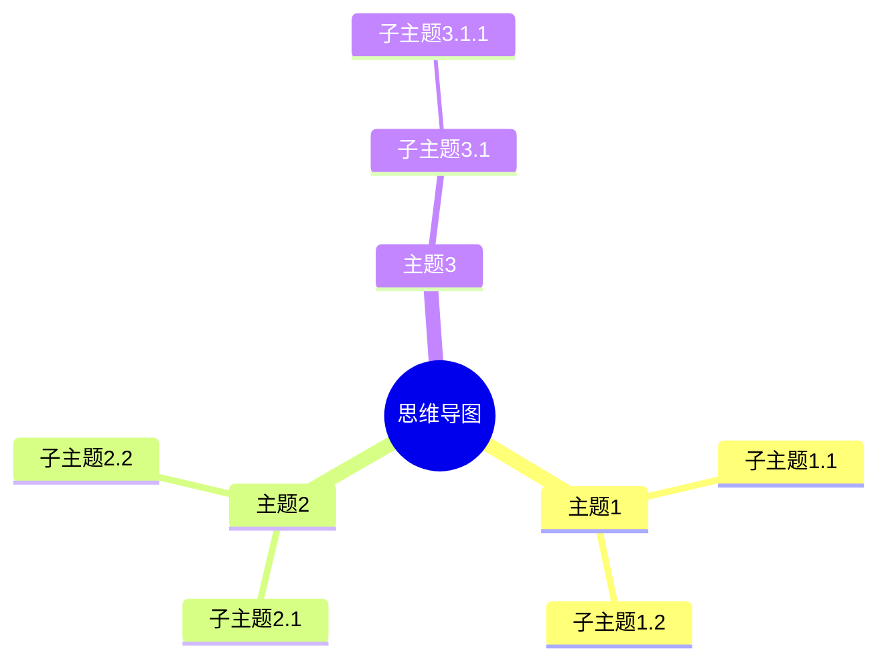

+++
date = 2024-01-24T18:09:49-08:00
title = 'Math examples'
draft = true
comments = true
[params]
  math = true
+++

This is an inline $a^*=x-b^*$ equation.

These are also block equations:

$$a^*=x-b^*$$

$$ a^*=x-b^* $$

$$
a^*=x-b^*
$$

## 思维导图

