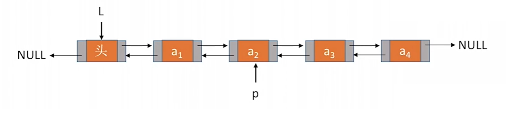
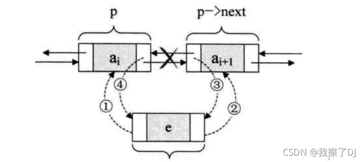
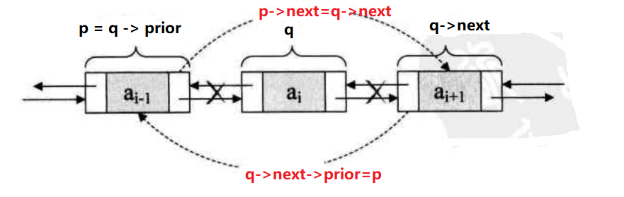

## 说明

双链表：在单链表的基础上再增加一个指针域，用于指向它的前驱结点

双链表组成：prior指针，数据域data，next指针

对于结点p，`p->prior`找前驱，`p->next`找后继



## 双链表结构定义

```c++
typedef int ElemType;
typedef struct DNode {
    ElemType data;
    struct DNode *prior, *next;
} DNode, *DLinkList;
//强调节点：用DNode ，强调链表：用DLinkList
```

对于结点p，前驱结点就是`p->prior`，其后继结点就是`p->next`


## 双链表初始化


```c++
// 初始化双链表（带头结点）
bool InitDLinkList(DLinkList& L) {
    L = (DNode*)malloc(sizeof(DNode));
    if (L == NULL) {
        return false;
    }
    L->prior = NULL;
    L->next = NULL;
    return true;
}

```

## 双链表的查找

### 按位序查找

```c++
// 按位序查找，返回第i个结点
// 注意：头结点是第0个结点
DNode* GetElem(DLinkList& L, int i) {
    if (i < 0) {
        return NULL;
    }
    int j = 0;
    DNode* p = L;
    while (p != NULL && j < i) {
        p = p->next;
        j++;
    }
    return p;
}
```

### 按值查找

/按值查找，找到第一个数据域为e的结点

```c++
DNode* LocateElem(DLinkList L, ElemType e) {
    DNode* p = L;
    if (p == NULL) {
        return NULL;
    }
    p = p->next;
    while (p != NULL && p->data != e) {
        p = p->next;
    }
    return p;
}

```

## 双链表的插入

### 在结点p之后插入数据域为e的结点



```c++
// 后插：在结点p后面插入数据域为e的结点
bool InsertNextDNode(DNode* p, ElemType e) {
    if (p == NULL) {
        return false;
    }
    DNode* q = (DNode*)malloc(sizeof(DNode));
    if (q == NULL) {
        return false;
    }
    // 构造待插入结点
    q->data = e;
    q->next = NULL;
    q->prior = p;
    if (p->next != NULL) {
        // 原来p之后有节点
        p->next->prior = q;
        q->next = p->next;
    }
    p->next = q;
    return true;
}
```

### 在结点p之后插入结点s

```c++
// 后插：在结点p之后插入结点s
bool InsertNextDNode(DNode* p, DNode* s) {
    if (p == NULL || s == NULL) {
        return false;
    }
    s->next = p->next;
    if (p->next != NULL) {
        p->next->prior = s;
    }
    s->prior = p;
    p->next = s;
    return true;
}
```

### 在结点p之前前插入结点s

```c++
// 前插，在p结点前面插入结点s
bool InsertPriorDNode(DNode* p, DNode* s) {
    return InsertNextDNode(p->prior, s);
}
```

## 双链表的删除

### 删除结点p的后继结点



```c++
// 删除结点p的后继结点
bool DeleteNextNode(DNode* p) {
    if (p == NULL) {
        return false;
    }
    DNode* q = p->next;
    if (q == NULL) {
        return false;
    }
    p->next = q->next;
    if (q->next != NULL) {
        // p的后继的后继结点（即是q的后继结点）存在
        q->next->prior = p;
    }
    // 释放被删结点占用内存
    free(q);
    return true;
}

```

### 删除指定结点s

```c++
// 删除指定结点s
bool DeleteDNode(DNode* s) {
    DNode* p;
    p = s->prior;
    p->next = s->next;
    if (s->next != NULL) {
        s->next->prior = p;
    }
    free(s);
    return true;
}
```

### 删除位序i的结点，返回被删除结点的数据域e

```c++
// 删除位序i的结点i，e是结点i的值
bool ListDelete(DLinkList& L, int i, ElemType& e) {
    if (i <= 0 || i > Length(L)) {
        return false;
    }
    DNode* s;
    s = GetElem(L, i);
    if (s == NULL) {
        return false;
    }
    e = s->data;
    return DeleteDNode(s);
}
```

## 双链表的创建

### 头插法

```c++
// 头插法
DLinkList List_Head_Insert(DLinkList& L) {
    InitDLinkList(L);
    ElemType x;
    while (cin >> x) {
        // 始终在头结点进行插入
        InsertNextDNode(L, x);
    }
    return L;
}
```

### 尾插法

```c++
// 尾插法
DLinkList List_Tail_Insert(DLinkList& L) {
    InitDLinkList(L);
    DNode* p = L;
    ElemType x;
    while (cin >> x) {
        InsertNextDNode(p, x);
        // 插入参照结点不断更新为下一个结点p
        p = p->next;
    }
    return L;
}
```


## 双链表的销毁

双链表的销毁是对整个链表的删除，并释放所有节点占用的内存空间。

```c++
// 销毁双链表
bool DestoryDLinkList(DLinkList& L) {
    while (L->next != NULL) {
    	// 依次删除链表的下一个结点，直至只剩下L
        DeleteNextNode(L);
    }
    // 释放L占用内存
    free(L);
    L = NULL;
    return true;
}
```

## 双链表的长度

```c++
// 长度
int Length(DLinkList L) {
    DNode* p = L;
    int len = 0;
    if (p->next != NULL) {
        len++;
        p = p->next;
    }
    return len;
}
```

## 双链表的判空

```c++
// 判断双链表是否为空
bool Empty(DLinkList L) {
    if (L->next == NULL) {
        return true;
    }
    return false;
}
```

