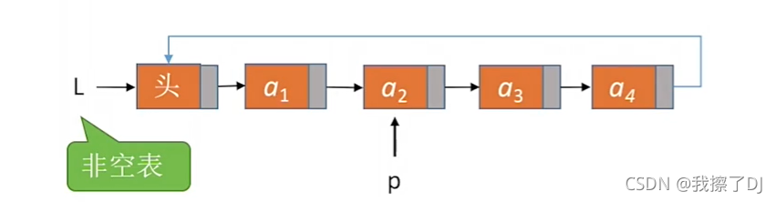
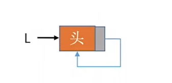
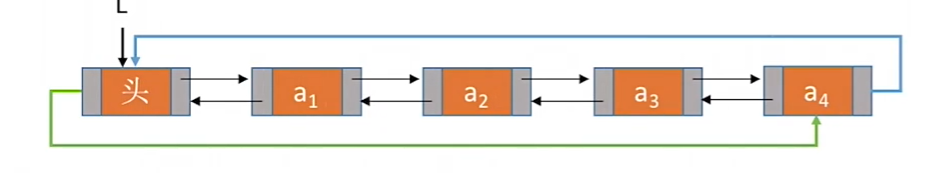

## 循环单链表

### 定义

循环单链表：尾节点的`next`指针由指向`NULL`改为指向`头结点`。



循环单链表的初始化：



### 代码

```c
#include <iostream>
using namespace std;

typedef int ElemType;
// 定义
typedef struct LNode {
    ElemType data;
    struct LNode* next;
} LNode, *Linklist;

// 初始化
bool InitList(Linklist& L) {
    L = (LNode*)malloc(sizeof(LNode));
    if (L == NULL) {
        return false;
    }
    // 头指针next指针指向头结点
    L->next = L;
    return true;
}

// 判空
bool Empty(Linklist L) {
    if (L->next == L) {
        return true;
    } else {
        return false;
    }
}

// 判断结点p是否为循环单链表的表尾结点
bool isTail(Linklist L, LNode* p) {
    if (p->next == L) {
        return true;
    } else {
        return false;
    }
}
```


## 循环双链表

### 定义

表头结点`prior指针指向尾结点`，尾结点的`next指针指向头结点`



循环双链表初始化


### 代码

```c
#include <iostream>
using namespace std;
// 结构体定义
typedef int ElemType;
typedef struct DNode {
    ElemType data;
    struct DNode *prior, *next;
} DNode, *DLinklist;

// 初始化
bool InitDLinklist(DLinklist& L) {
    L = (DNode*)malloc(sizeof(DNode));
    if (L == NULL) {
        return false;
    }
    L->prior = L;
    L->next = L;
    return true;
}
// 判空
bool Empty(DLinklist L) {
    if (L->next == L) {
        return true;
    } else {
        return false;
    }
}
//判断结点p是否为循环双链表的表尾结点
bool isTail(DLinklist L, DNode* p) {
    if (p->next == L) {
        return true;
    } else {
        return false;
    }
}

// 插入：在结点p后面插入结点s
bool InsertNextDNode(DNode* p, DNode* s) {
    s->next = p->next;
    p->next->prior = s;
    s->prior = p;
    p->next = s;
}

// 删除：删除结点p的后继结点q
bool DeleteNextDNode(DNode* p) {
    DNode* q = p->next;
    p->next = q->next;
    q->next->prior = p;
    free(q);
    return true;
}
```

