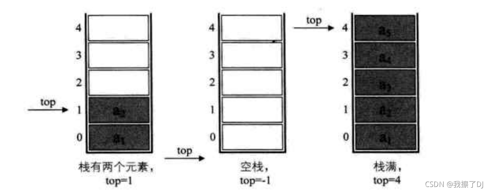
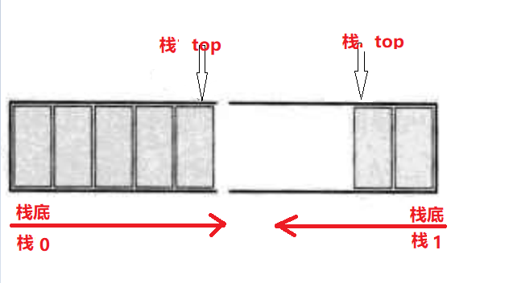
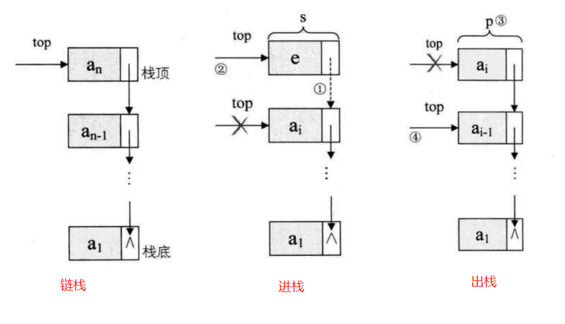

栈

## 定义

栈顶 & 栈底

## 顺序栈 

顺序栈：使用`数组`来实现。其中`下标为0`的一端作为栈底，将数组尾部作为栈顶，以进行插入和删除.

由于尾部元素作为**栈顶**，也即最后一个元素是**栈顶元素**，所以需要使用一个 **变量`top`** 进行标识，`top`之外元素将不属于栈的定义范围，通常把*`top=-1`定义为空栈

### 结构定义

```c
#define MaxSize 10
// 结构定义
typedef int ElemType;
typedef struct SqStack {
    ElemType arr[MaxSize];
    // 栈顶下标
    int top;
} SqStack;
```

MaxSize=5的情况下 



### 基本操作

```c
#include <iostream>
using namespace std;

#define MaxSize 10
// 结构定义
typedef int ElemType;
typedef struct SqStack {
    ElemType data[MaxSize];
    // 栈顶下标
    int top;
} SqStack;

// 初始化
void InitSqtack(SqStack& S) {
    S.top = -1;
}

// 判栈空
bool StackEmpty(SqStack S) {
    if (S.top == -1) {
        return true;
    } else {
        return false;
    }
}

// 新元素进栈
bool Push(SqStack& S, ElemType e) {
    if (S.top == MaxSize - 1) {
        // 栈满
        return false;
    }
    // 指针+1；新元素入栈
    S.data[++S.top] = e;
    return true;
}

// 元素出栈
bool Pop(SqStack& S, ElemType& e) {
    if (S.top == -1) {
        // 栈空
        return false;
    }
    // 先出栈，后top--
    e = S.data[S.top--];
    // 逻辑删除，出栈数据依然残留在内存中
    return true;
}

// 读取栈顶元素
bool GetTop(SqStack& S, ElemType& e) {
    if (S.top == -1) {
        // 栈空
        return false;
    }
    e = S.data[S.top];
    return true;
}

```

## 共享栈


顺序栈其缺点就在于**事先要确定空间大小，万一不够用了还需要进行扩容，很是麻烦**。有一种解决方法就是利用**共享栈**

### 定义

共享栈：利用栈底位置相对不变的特性，让两个顺序栈共享一个一维数组空间，将两个栈的栈底 分别设置在共享空间的两端，两个栈顶向共享空间的中间延伸。



- **判空：`top1==-1`且`top2==n`**

- **判满：普通情况下，`top1`和`top2`一般不碰面。但是当`top1+1==top2`时肯定就满了**

### 基本操作

```c
#define MaxSize 10 //定义栈中元素的最大个数

typedef struct SqDoubleStack {
    ElemType data[MaxSize];  //静态数组存放栈中元素
    int top0;                // 0号栈-栈顶指针
    int top1;                // 1号栈-栈顶指针
} SqDoubleStack;

//初始化共享栈
void InitSqStack(SqDoubleStack& S) {
    S.top0 = -1;       // 0号栈-栈顶指针
    S.top1 = MaxSize;  // 1号栈-栈顶指针
}

// 新元素入栈
bool Push(SqDoubleStack& S, ElemType e, int StackNumber) {
    // StackNumber用于标识是哪个栈进栈
    if (S.top1 + 1 == S.top2) {
        // 共享栈满了
        return false;
    }
    if (StackNumber == 0) {  //栈0进栈
        S.data[++s.top0] = e;
    }
    if (StackNumber == 1) {  //栈1进栈
        S.data[--s.top1] = e;
    }
    return true;
}

// 元素出栈
bool Pop(SqDoubleStack& S, DataType& e, int StackNumber) {
    if (StackNumber == 0) {
        if (S.top0 == -1) {  // 栈0是空栈
            return false;
        }
        e = S.data[S.top0--];
    } else if (StackNumber == 1) {
        if (S.top1 == MaxSize) {  // 栈1是空栈
            return false
        }
        e = S.data[S.top1++];
    }
    return true;
}

```


## 链式栈

### 定义

链栈：就是栈的**链式存储结构**。对于单链表来说它本身就具有头指针，所以可以让头指针和栈顶指针合二为一。同时，栈顶元素就在头部，因此头结点失去意义，所以对于 *链栈来说是不需要头结点的*。

链栈实际上：就是一个只能采用头插法插入或删除数据的链表;



### 基本操作

```c
#include <iostream>

using namespace std;

// 链栈结点定义
typedef int ElemType;
typedef struct StackNode {
    ElemType data;
    struct StackNode* next;
} StackNode;

typedef struct LinkStack {
    // 栈顶指针
    StackNode* top;
    // 栈结点数量
    int count;
} LinkStack;

// 结点进栈,链式栈无须考虑栈满
bool Push(LinkStack& S, ElemType e) {
    StackNode stackNode = (StackNode*)malloc(sizeof(StackNode));
    stackNode.data = e;
    stackNode.next = S.top;
    S.top = stackNode;
    S.count++;
    return true;
}

// 结点出栈，需考虑栈空情况
bool Pop(LinkStack& S, ElemType& e) {
    // 临时结点，便于销毁删除结点
    StackNode p;
    if (StackEmpty(S)) {
        return false;
    }
    e = S.top->data;
    p = S.top;
    // 栈顶指针后移
    S.top = S.top->next;
    free(p);
    S.count--;
    return true;
}
```


## 应用

可特兰数：

n个不同元素进栈，出栈元素不同排列的个数，可由卡特兰(Catalan)数确定：
​
$$
\begin{align*}
N &=  \frac{1}{n+1}  C_{2n}^{n}
\end{align*}
$$

- 比如上面的3个元素就有

$$
\begin{align*}
N &=  \frac{1}{4}  C_{6}^{3} = \frac{1}{4}* \frac{6*5*4}{3*2*1} = 5 种 \\
a \div b 
\end{align*}
$$

