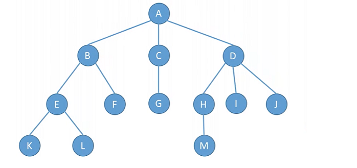
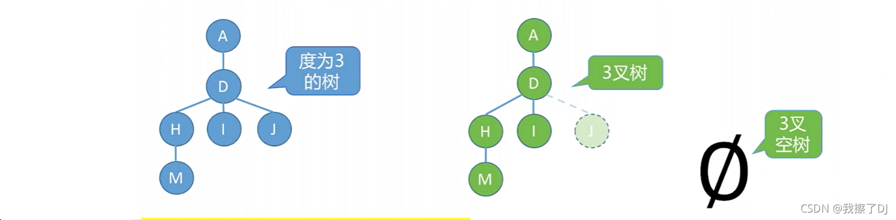
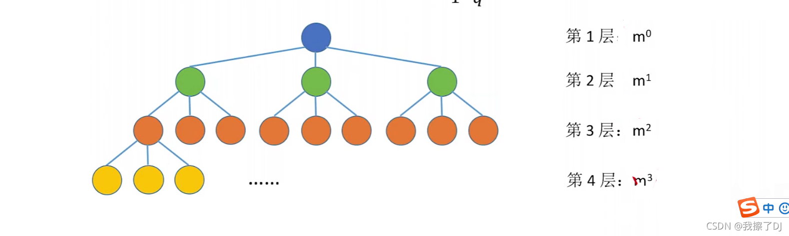
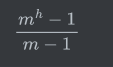
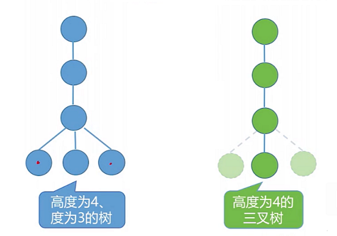

[TOC]

# 树的常考性质

## 性质1：结点数=总度数+1

结点数为13，度数为12

## 性质2：度为 m 的树和m叉树区别

| 度为m的树                                | m叉树                                  |
| ---------------------------------------- | -------------------------------------- |
| 任意结点的度小于等于m，也即**最多m个孩子 | 任意结点的度小于等于m，也即最多m个孩子 |
| **至少有一个结点度为m**                  | 允许所有结点的度都小于m                |
| 一定是非空树，至少有 m + 1个结点         | 可以是空树                             |

## 性质3：度为m的树第i层至多有 **m^i-1^** 个结点，其中 i大于等于1

## **性质4：高度为h的m叉树**至少**有h个结点，高度为h度为m的树至少有h+m-1个结点**

至多有个结点

## 性质5：具有 n个结点的m叉树的最小高度为  ⌈log~m~(n(m−1)+1)⌉