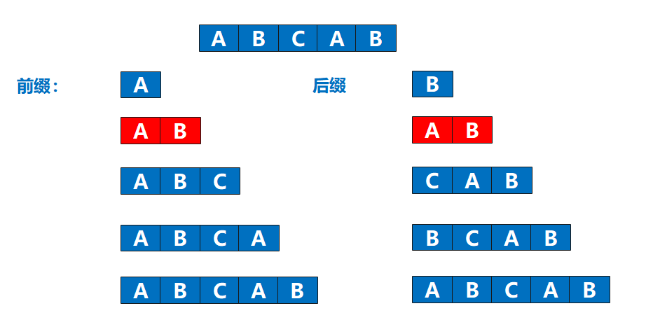

## 主串与模式串

> 例如：在字符串"我爱我的祖国"中查找"祖国"，则：
>
> - 主串：我爱我的祖国
> - 模式串（目标串）：祖国


## 最长相同前后缀



## 实现代码

```c
#include <string>
using namespace std;
/**
 * 求目标串的next数组
 * str：目标串
 * next：next数组（目标串下标- 该下标前面字符串的最长相同的前后缀）
 **/
void GetNext(string str, int next[]) {
    int j = 0, k = -1;  // j：目标串下标，0开始；k：对应next数组的值
    next[0] = -1;       // 目标串第一个元素，k永远是-1
    while (j < str.size()) {  // 遍历目标串
        if (k == -1 || str[j] == str[k]) {
            j++;
            k++;
            next[j] = k;
        } else {
            k = next[k];
        }
    }
}
```

> 例如：
>
> 目标串字符：  A B C A B C M N
> 目标串下标j： 0 1 2 3 4 5 6 7
> next数组值k：-1 0 0 0 1 2 3 0

## 参考

[算法了解](https://zhangxing-tech.blog.csdn.net/article/details/115139682#comments_22545310)
[做题求解](https://blog.csdn.net/m0_37482190/article/details/86667059)
