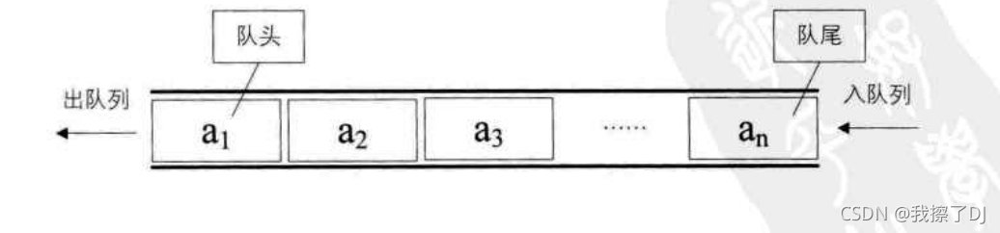

------

[TOC]

------


# 一：队列基本概念

## （1）队列的定义

**队列(Queue)：是一种只允许在一端插入（队尾），在另一端删除（队头）的线性表。**



## （2）入队和出队

**入队：是队列的插入操作**

**出队：是队列的删除操作**

如下


- **入队顺序**： a~1~>  a~2~  >a~3~> a~4~ >a~5~ 
- **出队顺序**：  a~1~>  a~2~  >a~3~> a~4~ >a~5~ 

## （3）队列的操作

一个队列的基本操作如下

- **`InitQueue(&Q)`**：初始化队列
- **`DestoryQueue(&Q)`**：销毁队列
- **`EnQueue(&Q,x)`**：入队
- **`DeQueue(&Q,&x)`**：出队
- **`GetHead(Q,&x)`**：读队头元素
- **`QueueEmpty(Q)`**：队列判空

# 二：队列的顺序存储结构

使用数组来完成栈的顺序存储结构是没有什么太大问题的（除了容量），但是如果用数组来实现队列的顺序存储结构却会产生很大问题

## （1）单纯的顺序存储的不足之处及font指针和rear指针

**1：队列采用顺序存储结构，如何解决出队列时元素移动导致时间复杂度很大的问题？**

假设一个队列有 n 个元素，则顺序存储的队列需要建立一个大于 n 的数组，并把队列的所有元素存储在数组的前 n个单元。**数组下标为0的一端就是队头**，如下


那么**入队列实际就是在队尾追加一个元素，不需要移动任何元素**，这一点没什么问题


但是要命的地方在于出队列，因为它限制在了队头也即下标为0的地方进行删除，那么这意味着**队头元素移出之后，剩余元素必须向前移动，以保证有元素始终处于队头位置，这样的话时间复杂度将达到 O ( n ) O(n) O(n)**


**因此对于这一点解决方法是：引入front指针指向队头元素，rear指针指向队尾元素的下一个位置**

- `rear`必须要指向队尾元素的下一个位置，否则无法区分队满还是队空（当`rear=front`就是队空了）

所以大家可以看到，在空队列时有`rear=front=0`。然后 a 1 a_{1} a1、 a 2 a_{2} a2、 a 3 a_{3} a3、 a 4 a_{4} a4依次入队。此时`front`指针不动，而`rear`指针指向了队尾元素的下一个位置


接着出队 a 1 a_{1} a1​、 a 2 a_{2} a2​，于是`front`指针指向下标为2的位置，而`rear`不变


------

**2：出队、入队都有可能导致数组越界，如何解决？**

紧接着上面那种情况，**`rear`已经指向了4，如果再入队一个元素 a 5 a_{5} a5，那么`rear`岂不是越界了？**


如果反映在数组上，我们知道编译器一定会给我们反馈“越界”的信息，但是很明显上面还有空余位置，**所以这是一种假溢出**

因此如果要完美的实现队列的顺序存储结构就必须要做一定的改进——**循环队列**

## （2）循环队列概念及队空队满条件

**循环队列：为了解决假溢出问题，可以将数组“头尾相接”形成一种逻辑上的环形结构**


这种“环形”只是一种**逻辑**上的感觉，其底层仍然是连续的空间，想要实现操作上的环形那么就必须**要对其下标的变换做一定的文章**（具体为什么是下面这样我就不细说了，其实就是利用了`%`元素，例如`1%12`会把结果映射到0~11这个范围）

- **`rear`移动时：`rear=(rear+1)%Maxsize)`**
- **`front`移动时：`front=(front+1)%Maxsize)`**

所以使用这种方式，当 a 5 a_{5} a5插入时，`rear`=(4+1)%5=0，于是就又回到了开头


------

数组空间毕竟是有限的，那么这样的结构其**队空队满**的条件是什么呢？如下

- **队空：`rear=front`**
- **队满：`front=(rear+1)%Maxsize`**

比如下面，`rear`开始为1，插入 a 7 a_{7} a7后,`rear`=(1+1)%5=3=`front`，此时队满


------

另外还有一种问题就是求队列长度，其**通用的公式为:`（rear-front+Maxsize）%Maxsize`**

## （3）循环队列定义

循环队列结构定义如下

```c
typedef struct
{
	DataType data[MaxSize];
	int front;//头指针
	int rear;//尾指针。若队列不空，指向队尾元素的下一个位置
}SqQueue;

```

初始化代码如下

```c
bool InitQueue(SqQueue& Q)
{
	Q.front=0;
	Q.rear=0;
	return true;
}

```

## （4）入队

**入队：入队时，先元素赋值，后`rear`指针+1（因为要保证`rear`指向队尾下一个位置）**

```c
bool EnQueue(SqQueue& Q,DataType e)
{
	if(Q.front==(Q.rear+1)%MaxSize)
		return false;//队满
	Q.data[Q.rear]=e;
	Q.rear=(Q.rear+1)%MaxSize;

	return true;
}
789
```

## （5）出队

**出队：出队时，直接`front`+1即可（`front`要始终指向队头元素）**

```c
bool DeQueue(SqQueue& Q,DataType& e)
{
	if(Q.front==Q.rear)
		return false;//队空
	*e=Q.data[Q.front];
	Q.front=(Q.front+1)%MaxSize;
	return true;
}
```

# 三：队列的链式存储结构

## （1）链式队列的定义

**链式队列：其本质仍然是单链表，不过只能尾进头出。为了操作方便，将`front`指针指向头结点,将`rear`指针指向队尾结点**


于是，在**队列为空**时，`front`和`rear`都将指向头结点


因此**链式队列结构定义如下**

```c
typedef struct QNode//结点
{
	DateType data;
	struct QNode* next;
}QNode;

typedef struct LinkQueue//链式栈
{
	QNode* rear;//队尾指针
	QNode& front;//队头指针
}LinkQueue;
```

## （2）入队

**入队时，在链表尾部插入结点**


```c
bool EnQueue(LinkQueue& Q,DataType e)
{
	QNode* NewNode=(QNode*)malloc(sizeof(QNode));
	if(NewNode==NULL)
		return false;
	NewNode->data=e;
	NewNode->next=NULL;
	Q->rear->next=NewNode;
	Q->rear=NewNode;//新节点作为队尾结点
}
```

## （3）出队

**删除时相当于链表的头删**


```c
bool DeQueue(LinkQueue& Q,DataType& e)
{
	Node* p;//用于释放
	if(Q.front==Q.rear)
		return false;
	p=Q.front->next;
	*e=p->data;
	Q.front->next=p->next;

	if(p==Q.rear)//注意如果队头就是队尾，那么删除是空队列
		Q.rear=Q.frontl
	free(p);
	return true;
}
```

# 四：双端队列

- 双端队列考点主要在**输出合法次序的判断**上
- 双端队列在C++是作为了STL容器中`deque`的底层结构，有兴趣可以了解：[6-5-2：STL之stack和queue——双端队列deque](https://blog.csdn.net/qq_39183034/article/details/117675751?ops_request_misc=%7B%22request%5Fid%22%3A%22163680422716780274173380%22%2C%22scm%22%3A%2220140713.130102334.pc%5Fblog.%22%7D&request_id=163680422716780274173380&biz_id=0&utm_medium=distribute.pc_search_result.none-task-blog-2~blog~first_rank_v2~rank_v29-1-117675751.pc_v2_rank_blog_default&utm_term=双端队列&spm=1018.2226.3001.4450)

## （1）：双端队列基本概念

**双端队列(Deque)：是一种可以在两端插入、删除的线性表。其中把允许一端插入、两端删除的称为输入受限的双端队列，把允许两端插入、一端删除的称为输出受限的双端队列**


如下


## （2）：双端队列输出序列合法性判断

双端队列是一种非常特殊的[线性表](https://so.csdn.net/so/search?q=线性表&spm=1001.2101.3001.7020)，**如果将其限制在只能在一端插入、删除那么它就退化为了栈结构**，在这种基础上又有两个变化方向

- **如果继续限制另一端只能删除那么就是输入受限的双端队列**
- **如果继续限制另一端只能插入那么就是输出受限的双端队列**

**如果输入数据的顺序为 1 1 1、 2 2 2、 3 3 3、 4 4 4**，先不管输出是否合法，总的输出的可能性总共有： A 4 4 = 4 ! = 24 A^{4}_{4}=4!=24 A44=4!=24种，如下


既然栈是一种特殊的双端队列，那么对于**栈来说是合法的次序，自然对双端队列也是合法的次序（输入受限和输出受限肯定都满足）**，根据卡特兰数计算可知 N = 1 n + 1 C 2 n n = 1 4 + 1 C 8 4 = 14 N=\frac{1}{n+1}C^{n}_{2n}=\frac{1}{4+1}C_{8}^{4}=14 N=n+11C2nn=4+11C84=14种，于是下面绿色部分是肯定是合理的


接着需要判断红色部分的序列，**因为红色部分在输入受限和输出受限中可能会不满足**

- 输入受限双端队列合理序列：绿色部分+绿色部分
  
- 输出受限双端队列合理序列：绿色部分+绿色部分
  