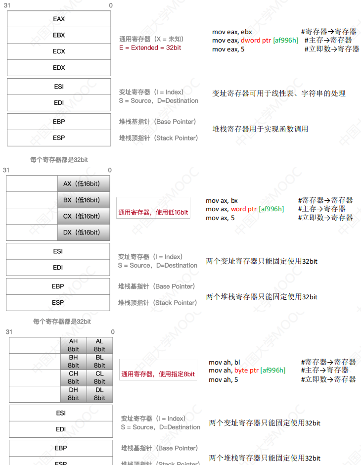
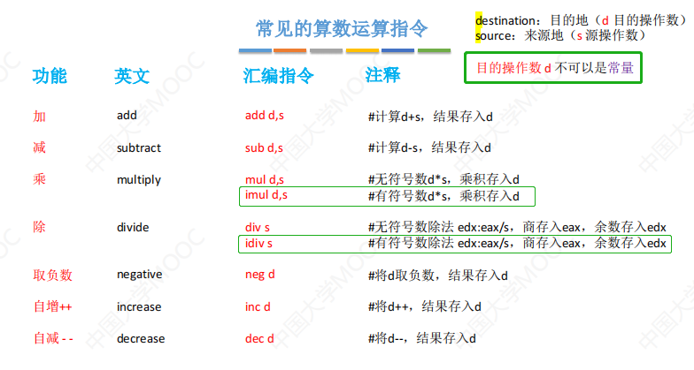
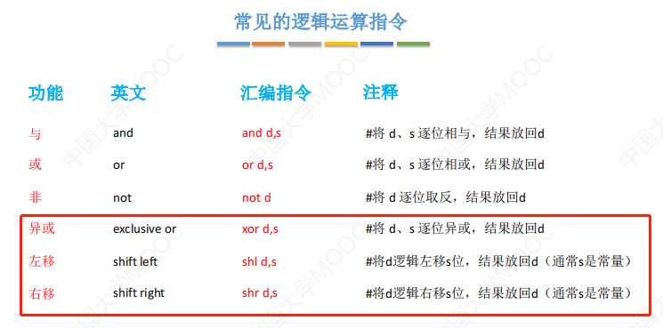
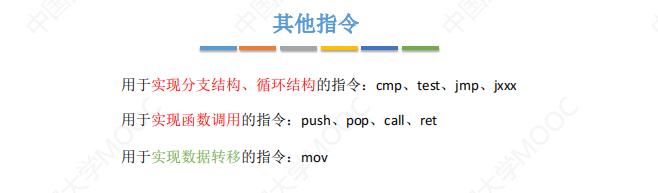
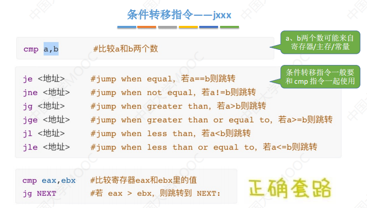
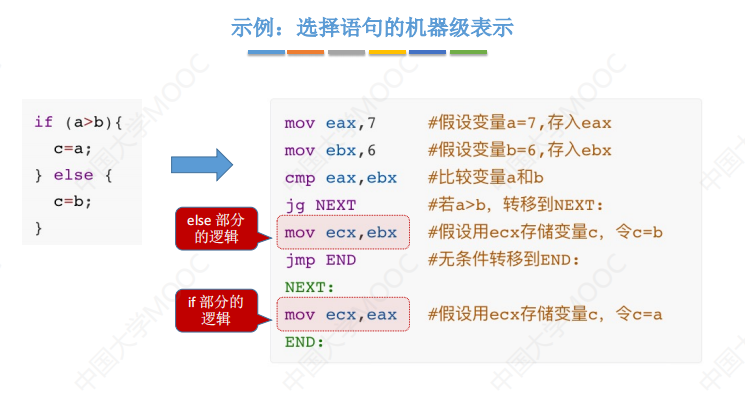
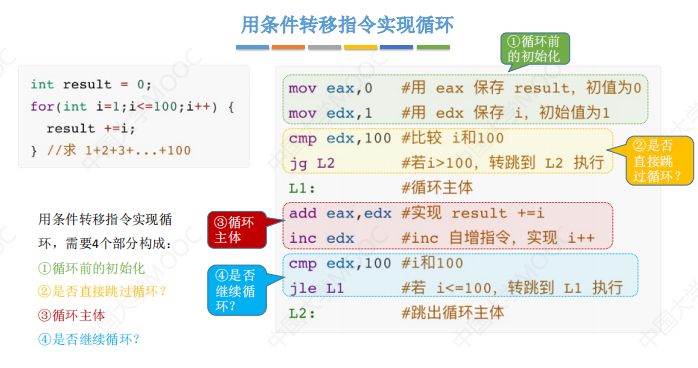
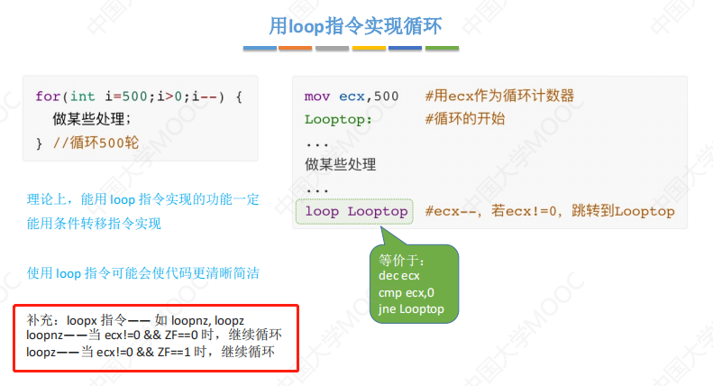

# mov指令

## 指令格式

<pre>
mov 目的操作数d,源操作数s    #mov指令功能：将源操作数s复制到目的操作数d所在位置
说明：d：destination s：source
</pre>

```shell
mov eax,ebx    # 将寄存器ebx的值复制到寄存器eax
mov eax,5      # 将立即数5复制到寄存器eax
mov eax,dword ptr [af996h] # 将内存地址 af996h 所指的32bit值复制到寄存器eax
mov byte ptr [af996h],5 # 将立即数5复制到内存地址 af996h 所指的一字节中

mov eax,dword ptr [ebx] # 将ebx所指主存地址的32bit复制到寄存器eax中
mov dword ptr [ebx],eax # 将eax的内存复制到ebx所指主存地址的32bit
mov eax,byte ptr[ebx] # 将ebx所指的主存地址的8bit复制到eax
mov eax,[ebx]  # 若为指明主存的读写长度，默认是32bit
mov [af996h],eax # 将eax的内容复制到af996h所指的地址（未指明长度默认32bit）
mov eax,dword ptr [ebx+8] # 将ebx+8所指的主存地址的32bit复制到eax寄存器中
mov eax,dword ptr [af996h-12h] # 将af996-12所指的主存地址的32bit复制到eax寄存器中
```

<pre>
dword ptr：双字，32bit 
word ptr：单字，16bit 
byte ptr：字节，8bit
</pre>

## x86架构CPU的寄存器

<pre>
每个寄存器都是32bit
通用寄存器：EAX、EBX、ECX、EDX
变址寄存器：ESI、EDI
堆栈寄存器：EBP、ESP
</pre>



# 算数运算指令



# 逻辑运算指令



# 其他指令



# 无条件指令

<pre>
无条件转移指令
jmp <地址> #PC 无条件转移至 <地址>
jmp 128 #<地址>可以用常数给出
jmp eax #<地址>可以来自于寄存器
jmp [999] #<地址>可以来自于主存
jmp NEXT #<地址>可以用“标号”锚定
</pre>

# 条件指令




# 循环语句的机器级表示

- 通过条件指令
  
- 通过loop指令
  
